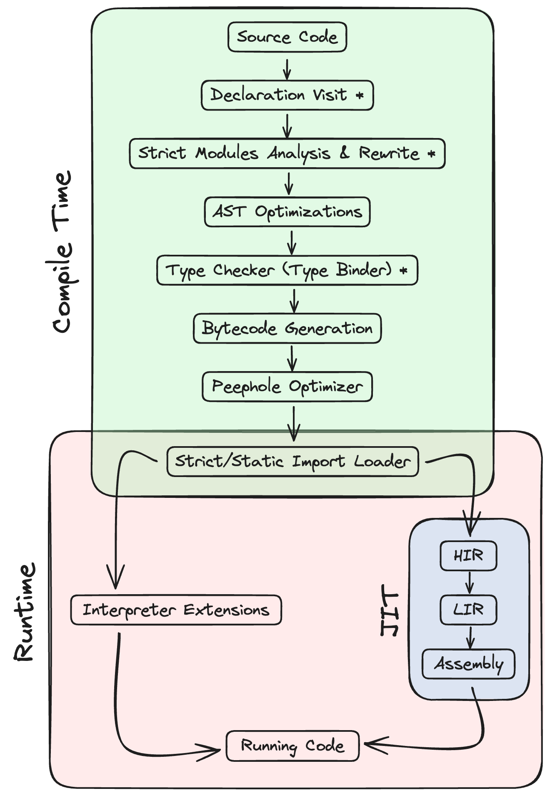

# Static Python (Developer Guide)

This guide is intended to be a high level introduction for folks who are
interested in contributing to Static Python.

## Overview

In a single sentence, Static Python is a bytecode compiler which uses
existing type annotations to make Python code more efficient.
Internally, it consists of a few components. Broadly, we have runtime
components and compile-time components.

The following diagram shows the overall flow of information. The steps
marked with `*` are newly introduced by Static Python, the
remaining ones also exist in regular CPython:

## Compilation Steps

High level description of each step in the flowchart.

| Step                              | Phase                  | Description                                                                                                                                                                                                                                                                                                                                                                                                                                                                                                                                                                   |
|-----------------------------------|------------------------|-------------------------------------------------------------------------------------------------------------------------------------------------------------------------------------------------------------------------------------------------------------------------------------------------------------------------------------------------------------------------------------------------------------------------------------------------------------------------------------------------------------------------------------------------------------------------------|
| Source Code                       | Pre-compile            | This is just the raw text source code. Technically, it’s not even a step, but it occurs in the diagram, therefore has its own entry.                                                                                                                                                                                                                                                                                                                                                                                                                                          |
| Declaration Visit                 | Compile Time           | When a module is being loaded, we need to know the symbols that are declared within it. Some of our analyses rely on this information (before even getting to the actual code generation steps).                                                                                                                                                                                                                                                                                                                                                                              |
| Strict Modules analysis + rewrite | Compile Time           | This is where we run the Strict Module analyzer and rewriter. The rewriter is an AST transformation, and includes features such as inserting non-changeable builtin functions (e.g len(), into the module namespace. The analyzer is an abstract interpreter which checks for import time side effects (and other things too, but that’s outside the scope of this document).                                                                                                                                                                                                 |
| AST Optimizations                 | Compile Time           | This step performs common optimizations on the AST, such as folding constant operations, optimizing immutable data structures, etc.                                                                                                                                                                                                                                                                                                                                                                                                                                           |
| Type Checker (Type Binder)        | Compile Time           | This is the magic step where we perform type analysis on the given code. We build a mapping from AST Node to Types, while also checking for correctness. In a few cases, we also perform type inference, to improve the experience of writing typed code. The Type Checker can also be run in a linting mode, where we output a list of detected type errors.                                                                                                                                                                                                                 |
| Code Generation                   | Compile Time           | In this step, we actually construct Python bytecode, by walking the AST. We take advantage of all the type information from the previous step, to generate efficient bytecode. In addition to opcodes in “normal” Python, Static Python uses a new specialized set of opcodes, which remove a lot of overhead associated with checking types at runtime. Whenever a type cannot be guaranteed by the Type Checker, we treat it as “dynamic” (or “Any”), and fall back to “normal” opcodes. In this way, our generated bytecode is fully compatible with untyped code as well! |
| Peephole optimizer                | Compile Time           | This performs further optimizations on the generated bytecode. E.g: removing bytecode that is unreachable.                                                                                                                                                                                                                                                                                                                                                                                                                                                                    |
| Strict/Static import loader       | Compile Time + Runtime | The Import loader is an implementation of importlib.abc.SourceFileLoader. It is responsible for stuff like checking whether a module is strict/static, and then running the appropriate kinds of compilation steps on it. It is used at compile time, as well as runtime. During compilation, the Loader creates .pyc files. These can then be packaged and deployed on servers. At runtime, the loader imports and executes this bytecode. After this step, the bytecode may be executed by the interpreter (the eval loop), or may be further compiled by the Cinder JIT.   |
| Interpreter Extensions            | Runtime                | This refers to the new set of opcodes introduced by Static Python (as mentioned above). These are very closely related with the classloader, which we will discuss separately.                                                                                                                                                                                                                                                                                                                                                                                                |
| JIT                               | Runtime                | The JIT is vast enough to require its own set of high-level documentation. For the purposes of Static Python, we can think of it has having three compilation steps: - HIR (High level IR) - LIR (Low level IR) - Assembly (Generation of assembly code) Each of the above steps has its own optimization and analysis passes. Additionally, the JIT interacts heavily with Static Python through its support for primitive types. Needless to say, a majority of Static Python optimizations are enabled by the JIT.                                                         |
